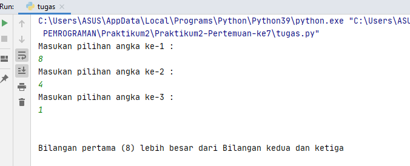
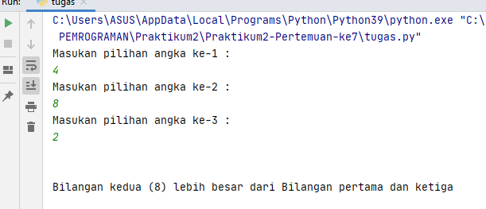
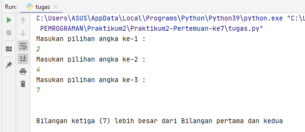
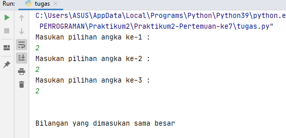

# Praktikum2-Pertemuan-ke7
Dibuat untuk memenuhi tugas Bahasa Pemrograman <br>

Nama    : Ahmad Reiza<br>
NIM     : 312010037<br>
Kelas   : TI.20.B.1<br>
<hr>

### Menentukan bilangan terbesar dari 3 nilai yang diinputkan
<br>
Pada Pertemuan ke-7 ini saya mendapat tugas membuat aplikasi yang menentukan bilangan terbesar dari tiga nilai yang client/user inputkan menggunakan Bahasa Pemrograman Pyython. <br>

Pada repository ini saya akan menjelaskan alur dalam *flowchart* yang telah saya buat, file *flowchart* bisa dilihat pada link berikut ini : [Praktikum2-Pertemuan-ke7](flowchart.pdf)
<br><br>
Berikut ini source code yang saya tulis untuk menjadikan aplikasi tersebut.

``` python
print("Masukan pilihan angka ke-1 : ")
xangka1 = int(input())
print("Masukan pilihan angka ke-2 : ")
xangka2 = int(input())
print("Masukan pilihan angka ke-3 : ")
xangka3 = int(input())

print("\n")

if (xangka1 > xangka2) and (xangka1 > xangka3):
    print(f"Bilangan pertama ({xangka1}) lebih besar dari Bilangan kedua dan ketiga")
elif (xangka2 > xangka1) and (xangka2 > xangka3):
    print(f"Bilangan kedua ({xangka2}) lebih besar dari Bilangan pertama dan ketiga")
elif (xangka1 == xangka2) and (xangka1 == xangka3) and (xangka2 == xangka3):
    print("Bilangan yang dimasukan sama besar")
else:
    print(f"Bilangan ketiga ({xangka3}) lebih besar dari Bilangan pertama dan kedua")
```

Saya akan menjelaskan langkah-langkah nya:<br>

* Langkah pertama yaitu saya akan membuat sebuah inputan tersebut untuk menentukan angka terbesar, yaitu dengan mengetikan perintah/syntax berikut ini :<br>

``` python
print("Masukan pilihan angka ke-1 : ")
xangka1 = int(input())
print("Masukan pilihan angka ke-2 : ")
xangka2 = int(input())
print("Masukan pilihan angka ke-3 : ")
xangka3 = int(input())
```
<br>

* Sesuai *flowchart* yang saya , client/user diminta untuk memasukan nilai inputan berupa angka dan akan disimpan kedalam variable xangka1,xangka2, dan xangka3. <br>
Setalah proses input nilai selesai buat, client/user diminta untuk memasukan nilai inputan berupa angka dan akan disimpan kedalam variable xangka1,xangka2, dan xangka3. <br>
Setelah proses input nilai selesai maka saya akan membuat pemilihan angka terbesar berdasarkan kondisi. <br>
<br> Pada kondisi pertama saya akan melakukan pengecekan terhadap angka petama (xangka) terlebih dahulu, yaitu dengan syntax/source code seperti dibawah ini :<br>

```python 
if (xangka1 > xangka2) and (xangka1 > xangka3):
```

Pada syntax diatas bahwa terdapat dua pengecekan pada angka pertama, yaitu :<br>
    1.(xangka1 > xangka2)* = Apakah angka pertama lebih besar dari angka kedua <br>
    2.(xangka1 > xangka3)* = Apakah angka pertama lebih besar dari angka ketiga <br>
<br>

 Jika pengecekan bersifat benar "angka pertama lebih besar dari angka kedua dan ketiga", maka system akan menampilkan output seperti dibawah ini :<br>
 
 ```python
print(f"Bilangan pertama ({xangka1}) lebih bsar dari bilanga kedua dan ketiga")
```

* Jika dalam pengecekan ada yang salah, maka sistem melakukan pengecekan lanjutan ke fungsi *elif....* yaitu dengan syntax atau source code berikut : <br>

```python
elif (xangka2 > xangka1) and (xangka2 > xangka3)
```

Pada syntax diatas bahwa terdapat dua pengecekan pada angka kedua, yaitu :<br>
    1. *(xangka2 > xangka1)* = Apakah angka kedua lebih besar dari angka pertama <br>
    2. *(xangka2 > xangka3)* = Apakah angka kedua lebih besar dari angka ketiga <br>
    
Jika pengecekan bersifat benar "angka kedua lebih besar dari angka pertama dan angka ketiga", maka hasil ouputnya seperti dibawah ini :<br>

```python
print(f"Bilangan kedua ({xangka2}) lebiih besar dari Bilangan pertama dan ketiga")
```

* Jika dalam pengecekan ada yang salah atau lebih kecil dari angka pertama dan ketiga, maka sistem akan melanjutkan ke pengecekan selanjutnya. <br>

Untuk pengecekan berikutnya saya akan melakukan pengecekan sperti *Apakah nilai yang inputnya nilainya sama besar?*. <br>

```python
elif (xangka1 == xangka2) and (xangka1 == xangka3) and (xangka2 == xangka3):
```
Pada syntax diatas terdapat tiga pengeckan pada semua variable, yaitu :<br>
    1. *(xangka1 == xangka2)* = Apakah angka pertama sama besar dengan angka kedua<br>
    2. *(xangka1 == xangka3)* = Apakah angka pertama sama besar dengan angka ketiiga<br>
    3. *(xangka2 == xangka3)* = Apakah angka kedua sama besar dengan angka ketiga<br>
<br>
Jika ternyata semua angka sama benar, maka sistem akan menampilkan ouput seperti dibawahini : <br>
```python
print("Bilangan yang dimasukan sama besar")
```

* Untuk selanjut sistem suadah memproses untuk melakukan pengecekan pada if. Elif maka sistem harus menentukan pilihan munggunakan fungsi *else*. <br>
Fungsi else sendiri adalah dimana sistem yang telah melakukan pengecekan pada if dan elif tetapi tidak ada hasil yang di inginkan, maka menentukan pilihan akhir, yaitu dengan hanya menampilkan output yang di inginkan . <br>

> Pengecekan pertama pada *xangka1* apakah lebih besar, jika tidak maka melakukan pada *xangka2* apakah lebih besar, jika masih belum menemukan hasil atau tidak lebih besar, dilakukan pengecekan berupa semua bilangan sama besar. Untuk langkah terakhir maka menampilkan hasil bahwa bilangan ketiga pasti bilangan terakhir.
<br>

Untuk menampilkan hasil akhir, maka hanya dengan mengetikkan syntax seperti dibawah ini :<br>
```python
else:
    print(f"Bilangan ketiga ({xangka3}) lebih besar Bilangan pertama dan kedua")
```
<br>

Berikut ini screenshot dari program yang saya buat :<br>
1. Angka terbesar ada di inputan pertama<br>
    
    <br>
2. Angka terbesar ada di inputan kedua<br>
    
    <br>
3. Angka terbesar ada di inputan ketiga<br>
    
    <br>
4. Angka yang sama besarnya<br>
     
    <br> 
<br>
Demikianlah langkah-langkah untuk melakukan pengecekan pada 3 inputan dengan Bahasa Pemrograman.Terima kasih. <br>
